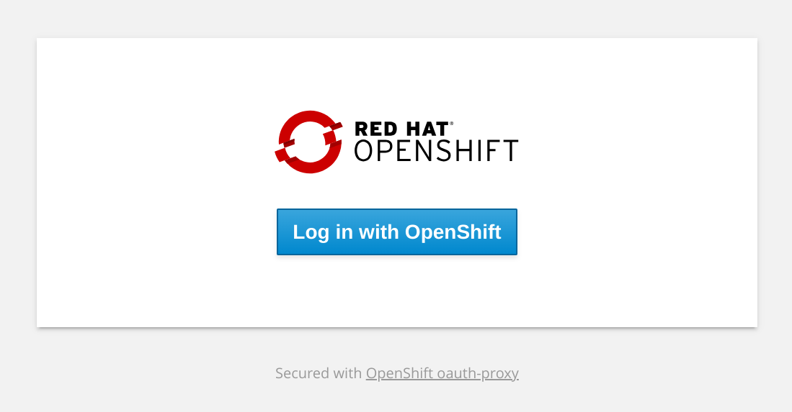
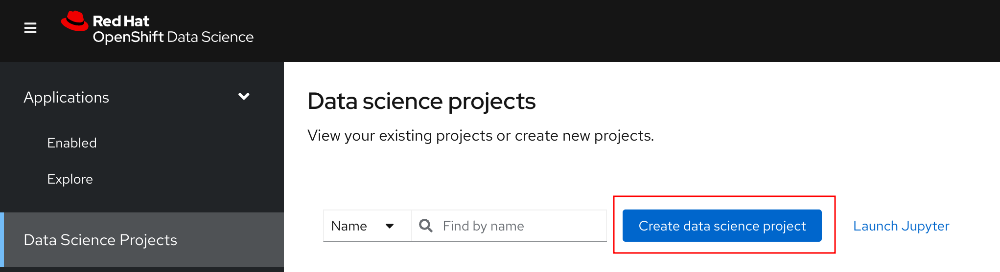
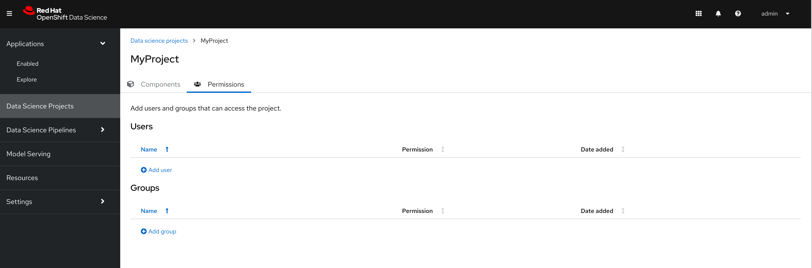

= Users and Permissions

== Logging Into RHODS

RHODS utilizes OpenShift OAuth as the authentication method for all RHODS related resources.  When attempting to log into the RHODS Dashboard or other UI components, users will be presented with a page prompting them to `Log in with OpenShift`.



By default, any user with the ability to login to OpenShift will be able to access the RHODS Dashboard.

[TIP]
====

For assistance with configuring user access to OpenShift with various identity providers, please refer to the official [Preparing for users](https://docs.openshift.com/container-platform/4.13/post_installation_configuration/preparing-for-users.html) OpenShift documentation.

====

== Admin Access

By default, users with the `cluster-admin` role are automatically granted admin permissions in the RHODS Dashboard.  Additional, a group called `rhods-admins` is automatically created, and any user added to that group will be granted admin permissions.

Admin access in the RHODS Dashboard allows users to control various settings of RHODS through the Dashboard UI, including:

- Configuring custom notebook images
- Configuring custom serving runtimes
- Configuring the idle notebook culler
- Other notebook configuration settings

== Updating Default User Permissions

The default permissions for the RHODS Dashboard can be updated through the `Settings`>`User management` section.

image::../images/user-management.png[]

The admin group can be updated to another group other than the default `rhods-admins` group, such as one that is configured to sync with an external system.  Additionally, admin permissions to the Dashboard are always granted to users assigned the 
cluster-admin ClusterRole.

[TIP]
====

It is highly recommended that dedicated admin users are configured for RHODS and that organizations do not rely on the `cluster-admin` role for exclusive permissions to admin configurations of RHODS.  Dedicated Admin users should be added to the existing `rhods-admins` group, or another group which already contains the correct users should be configured in lieu of the `rhods-admins` group.

====

The normal Data Science user group can also be updated to change what users are able to sign into the RHODS Dashboard.  By default, the Dashboard is configured to allow all authenticated users with the `system:authenticated` role.  A custom group can be configured to allow only specific users belonging to that group to access the Dashboard.

[WARNING]
====

Updating the access in the `User and group settings` in the Dashboard will only impact a users abilities to access the Dashbaord, and will not impact any permissions granted by regular Kubernetes based RBAC.  

For example, if the normal user group is updated to only allow specific users to access the Dashboard, and a user that is not part of that group has admin may still have the ability to create Data Science related objects such as Notebooks, Data Science Pipelines, or Model Servers in a namespace they have permission in using the associated k8s objects without the UI.

====

=== Managing Dashboard Permissions with GitOps

The `User and group settings` in the RHODS Dashboard can also be managed using the `OdhDashboardConfigs` objected called `odh-dashboard-config` located in the redhat-ods-applications namespace along with many of the other settings found in the Dashboard's Settings section:

```sh
oc get odhdashboardconfigs odh-dashboard-config -n redhat-ods-applications -o yaml
```

A truncated version of the OdhDashboardConfig object with the groupConfig settings can be found below:

```yaml
apiVersion: opendatahub.io/v1alpha
kind: OdhDashboardConfig
metadata:
  name: odh-dashboard-config
  namespace: redhat-ods-applications
spec:
  groupsConfig:
    adminGroups: rhods-admins
    allowedGroups: 'system:authenticated'
```

== Data Science Project Permissions

The RHODS Dashboard permits users of the Dashboard to create new Data Science Projects when self-provisioning is enabled on the cluster:



[TIP]
====

For information on how to disable self-provisioner on OpenShift refer to the official OpenShift documentation:

[Disabling project self-provisioning](https://docs.openshift.com/container-platform/4.13/applications/projects/configuring-project-creation.html#disabling-project-self-provisioning_configuring-project-creation)

====

When a user creates a new Data Science Project through the Dashboard, the Dashboard will create a corresponding OpenShift Project and Kubernetes Namespace.  The user who created the Data Science Project will automatically be granted admin permissions to the Namespace.

=== Managing Permissions on a Data Science Project

A Data Science Project is nothing more than a normal OpenShift Project with a few special labels.  As such, permissions to the project function the same as any other project/namespace in OpenShift.

Users can be granted permissions to the Project using traditional RBAC configuration.

Additionally, the Dashboard provides a user interface that will allow Admins on the project to easily apply `edit` or `admin` access to other users or groups.  The Permissions view can be access by navigating to a specific project under the Data Science Projects menu, and selecting the Permissions tab.



[NOTE]
====

The Dashboard Permissions user interface only displays users and groups that were granted permissions directly through the Dashboard.  Any users or groups that have been granted permission to the Project by manually creating RoleBindings on the project or who are granted higher level cluster permissions will not be displayed in the user interface.

====

=== Manually Creating Data Science Projects

When self-provisioner is disabled on a cluster, a cluster administrator will be required to manually create Data Science Projects for users.

As mentioned previously, a Data Science Project is a normal OpenShift project/namespace with a few special labels that allow to to be managed by the RHODS Dashboard, allowing it to be managed using any existing processes or tools your organization already utilizes to manage namespaces.

To manually create a Data Science Project from the cli, you can run the following commands to create a namespace and apply the necessary labels:

```sh
oc create namespace myproject
oc label namespace myproject opendatahub.io/dashboard='true' modelmesh-enabled='true' 
```

Alternatively, the following YAML object can be used to create the Data Science Project:

```yaml
kind: Namespace
apiVersion: v1
metadata:
  name: myproject
  labels:
    modelmesh-enabled: 'true'
    opendatahub.io/dashboard: 'true'
```

Once the Data Science Project has been created, access to the project will need to be configured for the necessary user or group using either the cli, or a namespace RoleBinding.  Refer to the OpenShift documentation for [Adding roles to users](https://docs.openshift.com/container-platform/4.13/authentication/using-rbac.html#adding-roles_using-rbac) for additional instructions.

== Notes
* [Trevor] We should be recommending configuring users in the default RHODS admin group instead of relying on the cluster-admin role.
* Implications of users and groups on DS projects, workbenches, data connections, storage
* How to manage different groups of teams working in a large organization - some work needs to be shared, some needs to be isolated from others
* [Trevor] Might be worth at least touching on how group sync works a bit in OCP.  Probably a much deeper topic than we want to go in this training, but large organizations should be using group sync and managing those groups outside of the cluster.
* [Trevor] We need to cover how an admin can create data science projects for users when Self Provisioning is disabled on the cluster.
