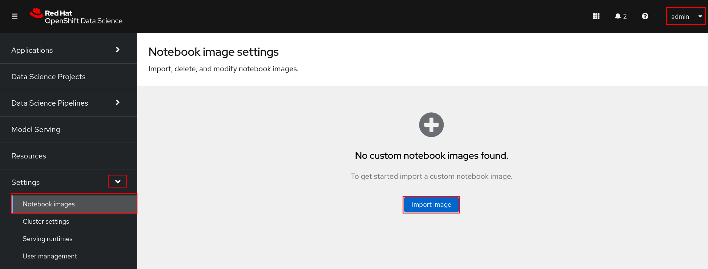

= Importing Custom Notebook Images

In this section we will go over importing a custom notebook through the RHODS dashboard.

== Import the Notebook Image
Login to the RHODS dashboard as the admin user. Expand *Settings*, click *Notebook Images*, and then click *Import Image*.

== Test the Image in a Workbench

